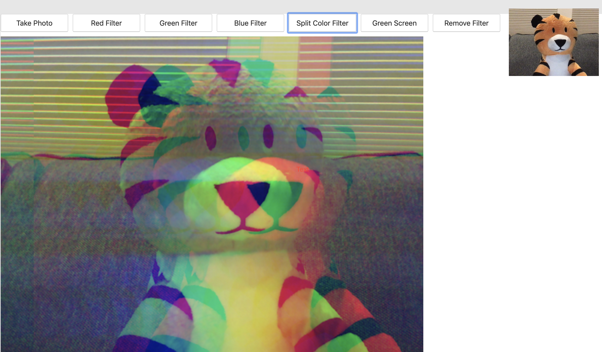

# 19. Webcam Fun

#### _Webcam Fun by JavaScript30 10/21/19_

## Description
This is Webcam Fun, 19th application out of 30 by 30 day Vanilla JavaScript Coding Challenge by Wes Bos.<br>
Please check the challenge from [JavaScript30](http://wesbos.com/javascript30/).




## About this Application:
- Accessing the camera.

- Using Media Capture and Stream API: [MDN link](https://developer.mozilla.org/en-US/docs/Web/API/Media_Streams_API).

- You can take a snapshot, add a red filter, green filter, blue filter, color split filter and green filter.

- Please allow the camera access.

## Setup/Installation

1. Clone this repo:
```
$ git clone https://github.com/misakimichy/JS30-19-webcam-fun.git
```

2. Go into this repo and install npm:
```
npm install
```

3. Once the npm is installed, run the server:
```
npm run start
```

4. The browser will ask you the camera access.

## Known Bugs
* No known bugs at this time.

## Support and contact details
 I welcome any feedbacks and comments: misaki.koonce@gmail.com

## Technologies Used
_Git, GitHub, HTML, CSS, Vanilla JavaScript and webpack

## License
Copyright © 2019 under the MIT License